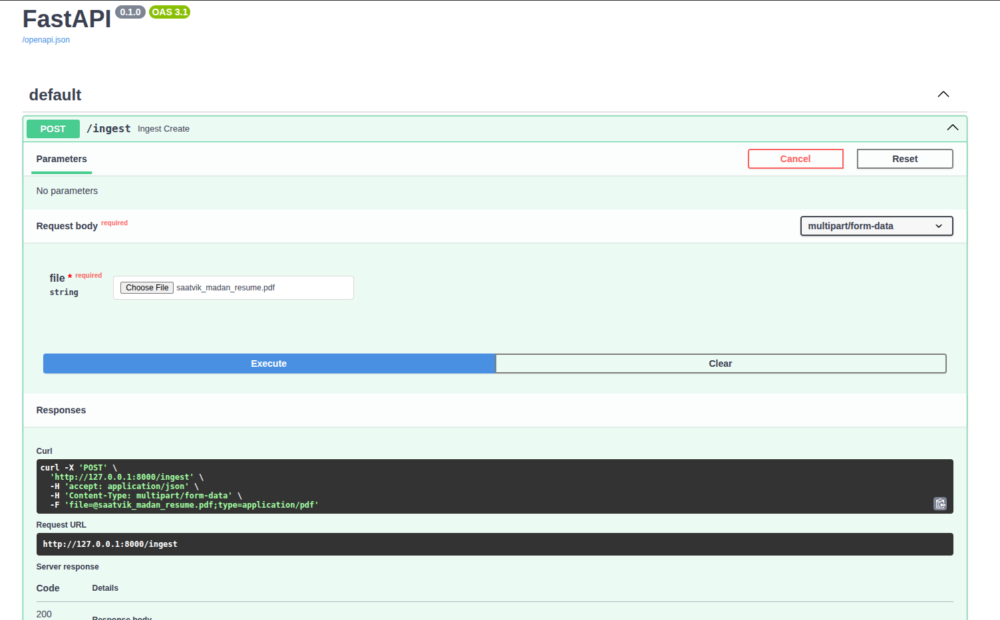
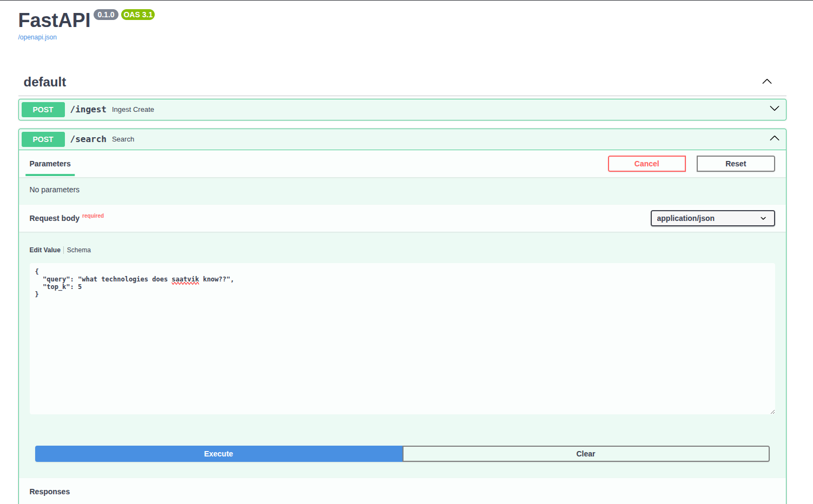
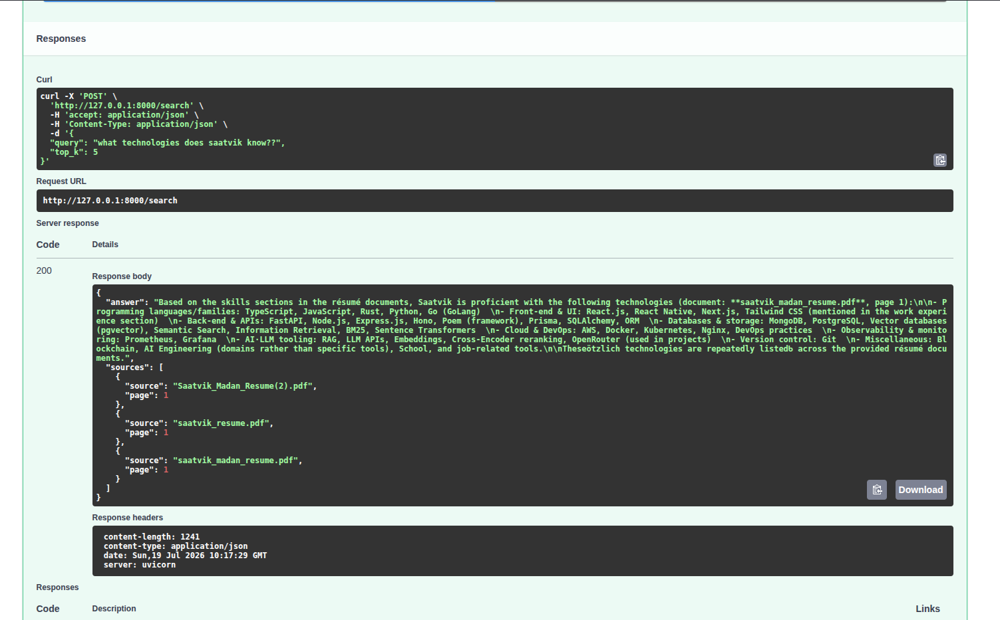

# Production-Grade RAG Engine from Scratch

A modular Retrieval-Augmented Generation (RAG) engine built from scratch using FastAPI, PostgreSQL (pgvector), Sentence Transformers, and OpenRouter.

---

## Demo

### 1. Ingest a PDF

Upload a PDF document to extract text, generate embeddings, and index it for retrieval.

<p align="center">
  
</p>

---

### 2. Search

Ask natural language questions against the indexed documents.

<p align="center">
  
</p>

---

### 3. Grounded Response

The engine retrieves relevant chunks using Hybrid Retrieval (Dense Retrieval + BM25 + RRF), reranks them with a Cross-Encoder, and generates a grounded answer with source citations.

<p align="center">
  
</p>

---

## Features

- PDF document ingestion
- Metadata-aware chunking
- Semantic embeddings
- PostgreSQL + pgvector vector search
- BM25 lexical retrieval
- Hybrid Retrieval (RRF)
- Cross-Encoder reranking
- Context construction
- Prompt construction
- Grounded LLM responses
- Source citations
- Query observability

---

## Retrieval Pipeline Overview

```text
                PDF Documents
                      │
                      ▼
              Metadata Chunking
                      │
                      ▼
             Embedding Generation
                      │
                      ▼
             PostgreSQL + pgvector


──────────────────────────────────────────────


                User Question
                      │
          ┌───────────┴───────────┐
          ▼                       ▼
    Query Embedding        BM25 Retrieval
          │                       │
          ▼                       ▼
     Vector Search         Lexical Search
          └───────────┬───────────┘
                      ▼
           Reciprocal Rank Fusion
                      │
                      ▼
           Cross-Encoder Reranker
                      │
                      ▼
               Context Builder
                      │
                      ▼
                Prompt Builder
                      │
                      ▼
                OpenRouter LLM
                      │
                      ▼
               Grounded Response
                      │
                      ▼
           Source Citations & Metrics
```

---

## API Endpoints

| Method | Endpoint | Description |
|--------|----------|-------------|
| POST | `/ingest` | Upload and index PDF documents |
| POST | `/search` | Hybrid retrieval and grounded question answering |

---

## Tech Stack

- FastAPI
- PostgreSQL
- pgvector
- SQLAlchemy
- Sentence Transformers
- PyMuPDF
- OpenRouter

---

## Core Concepts

- Dense Retrieval
- Sparse Retrieval (BM25)
- Hybrid Retrieval
- Reciprocal Rank Fusion (RRF)
- Cross-Encoder Reranking
- Semantic Search
- Vector Databases
- Context Engineering
- Prompt Engineering
- Grounded Generation
- Source Attribution
- Retrieval Observability

---

## Retrieval Pipeline

1. Extract text from PDF documents.
2. Split documents into metadata-aware chunks.
3. Generate semantic embeddings.
4. Store embeddings in PostgreSQL using pgvector.
5. Generate the query embedding.
6. Retrieve semantic candidates using vector search.
7. Retrieve lexical candidates using BM25.
8. Fuse both rankings using Reciprocal Rank Fusion (RRF).
9. Rerank the fused candidates using a Cross-Encoder.
10. Build contextual prompts from the highest-ranked chunks.
11. Generate grounded responses using OpenRouter.
12. Return answers with source citations and observability metrics.